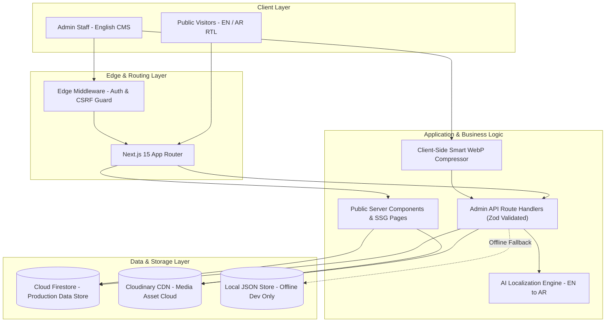

# SUHAR Advertising — Enterprise Technical & Architectural Documentation

> **Document Version:** 1.1.0 (Audited & Hardened)  
> **Target Audience:** Chief Technology Officer (CTO), Lead Architects & Engineering Team  
> **Security Audit Status:** Formally Audited (See `SECURITY_AUDIT.md`)  
> **Deployment Target:** Next.js Serverless (Vercel / Node.js Runtime)  

---

## 1. Executive Summary & Architectural Overview

The **SUHAR Advertising** digital platform is an enterprise-grade, high-performance, bilingual (English & Arabic with full RTL support) web application and custom Headless Content Management System (CMS). 

Built specifically for a premier branding and advertising agency in the Sultanate of Oman, the system couples a **fluid, visually immersive public frontend** (powered by GSAP ScrollTrigger animations and Next.js 15) with an **autonomous, English-first CMS dashboard**. The CMS eliminates developer dependency by allowing non-technical marketing staff to manage portfolio projects, client rosters, client reviews, and site-wide display parameters in real time.

### High-Level System Architecture



---

## 2. Technology Stack & Specifications

| Layer / Concern | Technology / Library | Exact Installed Version | Technical Role & Specification |
| :--- | :--- | :--- | :--- |
| **Core Framework** | Next.js (App Router) | `15.5.25` | React Server Components, hybrid SSR/SSG on-demand revalidation, route handlers. |
| **UI Library** | React / TypeScript | `19.2.7` / `5.8.3` | Strict type safety, functional state hooks, React Server Actions compatibility. |
| **Styling Engine** | Tailwind CSS v4 | `4.0.0` | High-performance CSS compilation, zero runtime overhead, CSS custom properties. |
| **Motion & Animation** | GSAP + ScrollTrigger | `3.15.0` | Hardware-accelerated storytelling animations, hero typography reveals, marquees. |
| **Database** | Google Cloud Firestore | `12.19.0` | Cloud NoSQL document database; all writes strictly restricted to server routes. |
| **Media Cloud & CDN** | Cloudinary v2 SDK | `2.11.0` | CDN-based global media delivery with automatic format and quality optimization. |
| **Pre-Upload Optimization**| Browser Canvas Compressor | Custom (`src/lib/imageCompressor.ts`) | Downscales oversized camera images (max 2048px) to WebP (0.85 quality) in browser. |
| **Schema Validation** | Zod | `3.24.2` | Runtime schema validation on all incoming administrative API mutation payloads. |
| **Internationalization** | Custom Context Engine | Native React Context | Zero-bundle-penalty i18n with instant RTL/LTR DOM transformation. |
| **AI Translation** | Google Cloud Translate API | Edge Fetch | Transparent automated Arabic generation for English-only admin inputs. |
| **Authentication** | Signed Cookie Sessions | Web Crypto / Node crypto | Single-administrator authentication using HMAC-SHA256 HttpOnly signed cookies. |

---

## 3. Directory & File Structure

```text
SUHAR-Advertising/
├── src/
│   ├── app/
│   │   ├── admin/                         # CMS Admin Dashboard (Protected UI)
│   │   │   ├── categories/page.tsx        # Project categories management
│   │   │   ├── clients/page.tsx           # Client logo partners management
│   │   │   ├── login/page.tsx             # Enterprise admin authentication
│   │   │   ├── testimonials/page.tsx      # Testimonials management & dynamic display limit
│   │   │   ├── works/
│   │   │   │   ├── page.tsx               # Projects catalog view
│   │   │   │   ├── new/page.tsx           # Create project view
│   │   │   │   └── [id]/edit/page.tsx     # Edit project view
│   │   │   ├── layout.tsx                 # Responsive admin shell & navigation
│   │   │   └── page.tsx                   # Admin KPI dashboard & analytics overview
│   │   ├── api/admin/                     # Secure REST API Endpoints
│   │   │   ├── auth/                      # Login (rate-limited), logout, session verification
│   │   │   ├── categories/                # Categories CRUD & referential integrity checks
│   │   │   ├── clients/                   # Client logos CRUD (public isolation)
│   │   │   ├── testimonials/              # Testimonials CRUD & atomic batch reorder
│   │   │   ├── works/                     # Projects CRUD & collision-free slug handling
│   │   │   ├── upload/                    # Cloudinary upload pipeline with magic byte validation
│   │   │   ├── translate/                 # Automated AI Arabic translation (rate/length capped)
│   │   │   └── seed/                      # Firestore data synchronization (disabled in prod)
│   │   ├── portfolio/page.tsx             # Public portfolio gallery
│   │   ├── works/
│   │   │   ├── page.tsx                   # Public works index with category filters
│   │   │   └── [slug]/page.tsx            # Dynamic SSG project case study detail
│   │   ├── layout.tsx                     # Root layout with i18n Direction Provider
│   │   └── page.tsx                       # High-impact agency homepage
│   ├── components/
│   │   ├── admin/                         # Reusable CMS form components
│   │   │   ├── ProjectForm.tsx            # English-only unified project creator
│   │   │   └── FirebaseSyncButton.tsx     # 1-click cloud database sync
│   │   ├── common/                        # Shared UI components (Reveal, Modals, Navbar, Footer)
│   │   └── sections/                      # Homepage animated sections (Hero, Works, Testimonials, Clients)
│   ├── lib/
│   │   ├── auth/session.ts                # Timing-safe cryptographic session token engine
│   │   ├── cloudinary.ts                  # Cloudinary v2 SDK uploader and transformer
│   │   ├── firebase/
│   │   │   ├── config.ts                  # Firebase client/admin configuration
│   │   │   └── db.ts                      # Universal Data Access Layer (Firestore + Fallback)
│   │   ├── imageCompressor.ts             # Client-side 2K WebP canvas compressor
│   │   ├── validation.ts                  # Centralized Zod schema validation rules
│   │   ├── i18n.tsx                       # Bilingual translation dictionary & RTL context
│   │   ├── projects.ts                    # Static fallbacks and typography constants
│   │   └── translate.ts                   # Google Cloud Translation gateway
│   ├── middleware.ts                      # Edge auth guard & CSRF protection
│   └── types/
│       └── cms.ts                         # Universal TypeScript schemas and domain models
├── firestore.rules                        # Enforced database security rules
├── SECURITY_AUDIT.md                      # Comprehensive security verification report
├── .env.example                           # Standardized environment template with placeholders
├── .env.local                             # Local secret keys (Strictly Git-ignored)
└── package.json                           # Engine dependencies and scripts
```

---

## 4. Database Schema & Data Models

All entities are typed with strict TypeScript contracts (`src/types/cms.ts`) and validated at runtime using Zod (`src/lib/validation.ts`):

### 4.1. Projects Collection (`projects`)
```typescript
interface CMSProject {
  id: string;                      // Unique ID (slug or UUID)
  slug: string;                    // URL-safe route slug (e.g., 'muscat-retail-group')
  title_en: string;                // Project title in English (Max 200 chars)
  title_ar: string;                // Project title in Arabic (Auto-translated if omitted)
  subtitle_en?: string;            // English summary
  subtitle_ar?: string;            // Arabic summary
  category_slug: string;           // Primary category slug reference
  category?: string;               // Compatibility alias
  client_en: string;               // Client name (English)
  client_ar: string;               // Client name (Arabic)
  year: string;                    // Project completion year (e.g., '2026')
  location_en: string;             // Location (English)
  location_ar: string;             // Location (Arabic)
  overview_en: string;             // Case study background (Max 5000 chars)
  overview_ar: string;             // Case study background (Arabic)
  challenge_en?: string;           // Problem statement
  challenge_ar?: string;           // Problem statement (Arabic)
  solution_en?: string;            // Implemented strategy
  solution_ar?: string;            // Implemented strategy (Arabic)
  deliverables_en: string[];       // Array of deliverables (e.g. ['Signage', 'Identity'])
  deliverables_ar: string[];       // Array of deliverables in Arabic
  impact_en?: string[];            // Business results / statistics
  impact_ar?: string[];            // Business results in Arabic
  cover_image: string;             // Cloudinary CDN URL or local path
  gallery: string[];               // Array of Cloudinary CDN URLs
  is_featured: boolean;            // Highlighted on homepage showcase
  is_published: boolean;           // Public visibility toggle
  display_order: number;           // Sorting weight (ascending)
  created_at?: string;             // ISO-8601 timestamp
  updated_at: string;              // ISO-8601 timestamp
}
```

### 4.2. Categories Collection (`categories`)
```typescript
interface Category {
  id: string;                      // Category slug (e.g., 'branding')
  slug: string;                    // URL-safe identifier
  name_en: string;                 // Display label in English
  name_ar: string;                 // Display label in Arabic
  display_order: number;           // Sorting sequence
}
```

### 4.3. Testimonials Collection (`testimonials`)
```typescript
interface CMSTestimonial {
  id: string;                      // Unique ID
  person_name_en: string;          // Author name (English)
  person_name_ar: string;          // Author name in Arabic
  designation_en?: string;         // Position (e.g., 'Marketing Director')
  designation_ar?: string;         // Position in Arabic
  company_en?: string;             // Organization name
  company_ar?: string;             // Organization name in Arabic
  text_en: string;                 // English testimonial quote (Max 2000 chars)
  text_ar: string;                 // Arabic testimonial quote
  rating?: number;                 // 1 to 5 stars (default: 5)
  photo_url?: string;              // Optional author portrait
  is_published: boolean;           // Eligibility switch
  display_order: number;           // Display priority weight
  created_at?: string;
  updated_at: string;
}
```

### 4.4. Client Logos Collection (`clients`)
```typescript
interface CMSClientLogo {
  id: string;                      // Unique ID
  name_en: string;                 // Brand name
  name_ar: string;                 // Brand name in Arabic
  logo_url: string;                // Cloudinary CDN URL
  website_url?: string;            // Optional external brand link
  display_order: number;           // Sorting sequence
  is_active: boolean;              // Visibility toggle
  created_at?: string;
  updated_at: string;
}
```

### 4.5. Global Settings Document (`settings/website`)
```typescript
interface CMSSettings {
  testimonial_display_count?: number; // Exact count of testimonials shown on website (0 = All)
  updated_at?: string;
}
```

---

## 5. Core Architectural Innovations & Engineering Features

### 5.1. Two-Tier Image Processing & Security Pipeline
1. **Client-Side Canvas Preprocessing (`src/lib/imageCompressor.ts`):**  
   Before large image files are transmitted over HTTP, an in-browser `HTMLCanvasElement` pipeline downscales the image to a maximum dimension of `2048px` (Retina standard) and re-encodes it into modern `image/webp` at `0.85` visual quality. This substantially reduces upload bandwidth, avoids serverless request body size limitations, and accelerates uploads.
2. **Server-Side Binary Magic Bytes Validation (`src/app/api/admin/upload/route.ts`):**  
   Before dispatching assets to Cloudinary, the upload controller inspects the binary magic bytes (`Buffer[0..11]`) to verify genuine JPEG, PNG, WebP, or GIF image headers. Client-provided MIME strings are not trusted. Raw SVG uploads are disabled to prevent Stored XSS attacks via active XML script payloads.
3. **Cloudinary CDN Integration (`src/lib/cloudinary.ts`):**  
   Validated assets are uploaded to Cloudinary CDN with automatic WebP conversion and `quality: auto:good` compression, served globally across edge locations.

### 5.2. Automated Bilingual AI Localization with Manual Preservation
The agency's internal admin team only operates in English. The CMS provides a dual-layer localization architecture:
* Upon saving new projects or testimonials, missing Arabic fields are automatically generated using the translation gateway (`src/lib/translate.ts`).
* **Non-Destructive Update Rule:** When an existing project or review is edited, any previously stored or customized Arabic translations (`title_ar`, `overview_ar`, `text_ar`, etc.) are preserved and will not be overwritten by English field edits.
* The public website dynamically switches layout directions (`dir="rtl"` vs `dir="ltr"`) and typography hierarchies.

### 5.3. Deterministic Testimonial Ordering & Conflict Resolution
* The system enforces a **deterministic secondary tie-breaker** (`display_order asc -> id asc`) to eliminate sorting ambiguity when two items share the same order number.
* The admin UI exposes an intuitive **3-State Status Matrix**:
  * 🟢 **Live on Website (Position #1..#N):** Testimonials actively visible to visitors under the current limit.
  * 🟡 **In Reserve (Exceeds Limit):** Fully active and approved testimonials held in reserve when the limit is reached.
  * ⚪ **Hidden:** Drafted or unverified items.
* Includes dedicated **Move Up (▲)** and **Move Down (▼)** swapping controls and an **"Auto-Clean (1, 2, 3...)"** batch re-indexer to eliminate duplicate ranks with a single click.

### 5.4. SEO-Safe Slug Preservation
When editing an existing project, the system strictly preserves the existing `slug` to avoid broken links and SEO penalties. For newly created projects without an explicit slug, a URL-safe slug is generated with automated collision avoidance (appending a unique suffix if a name matches an existing project).

---

## 6. Authentication, Authorization & Security Architecture

1. **Single-Administrator Authentication:**  
   The application authenticates a single administrator role using the server environment variables `ADMIN_EMAIL` and `ADMIN_PASSWORD`.
2. **Timing-Safe Cryptographic Comparisons:**  
   Session token signature verification and credential checks are performed using `crypto.timingSafeEqual` to eliminate timing side-channel attacks.
3. **HttpOnly Signed Cookie Session:**  
   Sessions are signed with HMAC-SHA256, marked `HttpOnly`, `SameSite=Lax`, and `Secure` in production, with a 24-hour expiration window.
4. **Edge-Level Route Shielding (`src/middleware.ts`):**  
   Intercepts all requests to `/admin/*`. Validates session token existence, structure, and expiration at the edge, redirecting unauthorized users to `/admin/login`.
5. **CSRF Origin Verification:**  
   All state-changing HTTP requests (`POST`, `PUT`, `PATCH`, `DELETE`) across `/api/admin/*` are verified against the host origin header to prevent cross-site request forgery.
6. **Public Data Isolation on API Endpoints:**  
   Unauthenticated public requests to `/api/admin/works`, `/api/admin/testimonials`, and `/api/admin/clients` are strictly constrained to published/active records. Unpublished drafts and internal settings are only returned when an authenticated admin session is present.
7. **Rate Limiting on Authentication:**  
   Login attempts are tracked per client IP with a sliding lockout window (15-minute lock after 5 failed attempts).

---

## 7. Database & Storage Architecture: Production vs Local

* **Cloud Production:**  
  Google Cloud Firestore is the primary, durable, persistent data store for all projects, categories, testimonials, clients, and settings. Firestore security rules (`firestore.rules`) enforce that all database mutations must occur via the server-side API.
* **Offline Local Development Fallback:**  
  The `data/cms-store.json` file is a local filesystem fallback used exclusively for local offline testing when Firebase credentials are not provided. In serverless cloud hosting (e.g. Vercel), container storage is ephemeral and Firestore is the sole durable source of truth.

---

## 8. API Surface & Route Specifications

| Route | Method | Auth Required | Validation Schema | Description |
| :--- | :---: | :---: | :--- | :--- |
| `/api/admin/auth/login` | `POST` | Public (Rate Limited) | Email/Password | Verifies admin credentials and sets signed HttpOnly session cookie. |
| `/api/admin/auth/logout` | `POST` | Public | None | Invalidates session cookie immediately. |
| `/api/admin/auth/me` | `GET` | Admin Session | None | Verifies active session token validity. |
| `/api/admin/works` | `GET` | Public (Filtered) / Admin | Query filters | Returns published projects (public) or all projects (admin). |
| `/api/admin/works` | `POST` | Admin Session | `projectInputSchema` | Creates project with auto-translation and collision-safe slug. |
| `/api/admin/works/[id]` | `GET` | Public (Filtered) / Admin | Dynamic route ID | Returns project details (404 on unpublished drafts if unauthenticated). |
| `/api/admin/works/[id]` | `PUT` | Admin Session | `projectInputSchema.partial()` | Updates project, preserving existing slug and manual translations. |
| `/api/admin/works/[id]` | `DELETE`| Admin Session | Dynamic route ID | Deletes project and invalidates static cache. |
| `/api/admin/categories` | `GET` | Public | None | Lists all active categories with project counts. |
| `/api/admin/categories` | `POST` | Admin Session | `categoryInputSchema` | Creates or updates a taxonomy category. |
| `/api/admin/categories` | `DELETE`| Admin Session | Query param `id` | Deletes category with referential integrity check (rejects if projects exist). |
| `/api/admin/testimonials` | `GET` | Public (Filtered) / Admin | Query filters | Returns testimonials matching current display limit. |
| `/api/admin/testimonials` | `POST` | Admin Session | `testimonialInputSchema` | Adds a client review with auto-translation. |
| `/api/admin/testimonials` | `PATCH` | Admin Session | `settingsPatchSchema` | Sets display count limit and performs atomic batch reordering. |
| `/api/admin/testimonials/[id]` | `PUT` | Admin Session | `testimonialInputSchema.partial()` | Updates testimonial details. |
| `/api/admin/testimonials/[id]` | `DELETE`| Admin Session | Dynamic route ID | Deletes testimonial. |
| `/api/admin/clients` | `GET` | Public (Filtered) / Admin | Query filters | Returns active partner logos (public) or all logos (admin). |
| `/api/admin/clients` | `POST` | Admin Session | `clientLogoInputSchema` | Adds or edits a brand partner logo. |
| `/api/admin/clients/[id]` | `PUT` | Admin Session | `clientLogoInputSchema.partial()` | Updates client logo. |
| `/api/admin/clients/[id]` | `DELETE`| Admin Session | Dynamic route ID | Deletes client logo. |
| `/api/admin/upload` | `POST` | Admin Session | Magic bytes verification | Validates raster image binary signature and uploads to Cloudinary CDN. |
| `/api/admin/translate` | `POST` | Admin Session | `translateInputSchema` | Translates English text to Arabic (max 5,000 chars). |
| `/api/admin/seed` | `POST` | Admin Session (Flagged) | Environment check | Syncs default records; disabled in production unless `ENABLE_SEED_ENDPOINT=true`. |

---

## 9. Deployment & Environment Configuration

### Required Environment Variables

Configure these keys in your deployment platform (e.g., Vercel, AWS Amplify, Docker):

```ini
# --- Google Cloud Firestore (Client Variables) ---
NEXT_PUBLIC_FIREBASE_API_KEY=<configured-in-deployment>
NEXT_PUBLIC_FIREBASE_AUTH_DOMAIN=<configured-in-deployment>
NEXT_PUBLIC_FIREBASE_PROJECT_ID=<configured-in-deployment>
NEXT_PUBLIC_FIREBASE_STORAGE_BUCKET=<configured-in-deployment>
NEXT_PUBLIC_FIREBASE_MESSAGING_SENDER_ID=<configured-in-deployment>
NEXT_PUBLIC_FIREBASE_APP_ID=<configured-in-deployment>
NEXT_PUBLIC_FIREBASE_MEASUREMENT_ID=<configured-in-deployment>

# --- Administrative Access (Server-Only Secrets) ---
ADMIN_EMAIL=<configured-in-deployment>
ADMIN_PASSWORD=<stored-securely>
ADMIN_SESSION_SECRET=<stored-securely>

# --- Cloudinary Media CDN (Server-Only Secrets) ---
CLOUDINARY_CLOUD_NAME=<configured-in-deployment>
CLOUDINARY_API_KEY=<configured-in-deployment>
CLOUDINARY_API_SECRET=<stored-securely>

# --- Optional Security Overrides ---
ENABLE_SEED_ENDPOINT=false
```

### Build & Run Commands

```bash
# Clean dependency installation
npm ci

# Type-check without emitting files
npx tsc --noEmit

# Static code analysis
npm run lint

# Automated integration & security smoke tests
npm test

# Compile production bundle
npm run build

# Start production server
npm run start -- -p 3000
```

---

## 10. Summary & Handover Note

This architecture provides **SUHAR Advertising** with an audited, hardened web platform and CMS. It combines custom branding and animations with an autonomous, English-first CMS protected by edge middleware, Zod schema validation, magic-byte upload controls, and Cloud Firestore persistence.

*Document compiled, verified, and audited for production deployment.*
